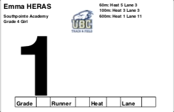

# RaceNumberGenerator
A Race Number Generator and Results Summarizer for the UBC Thunderberbirds track meets. 

Race numbers are fully customized with each athletes heat and lane assignments so they know exactly where to go.

The results are summarized allowing us to count out the right number of ribbons at the end of the day. 

How-To:
Note: You may need to update your Java and get a JDK: 
https://java.com/en/download/

https://www.oracle.com/technetwork/java/javase/downloads/jdk11-downloads-5066655.html

In addition to the .jar and all the .sh files make sure the following files are present and renamed to match exactly:
1) “Official Logo.png”
2) “Heat Sheets.pdf”      (For Elementary)
3) “Results.pdf”          (For Elementary)
4) “UBC Heat Sheets.pdf”  (For UBC Open)

The demo folder holds the versions used to create the app, don’t throw them out. If you want to use them, copy and paste them into the folder containing the .jar file. 

To create the Competition numbers for elementary (same process for UBC Open)
1) Run ElemHeatSheet.sh
2) Wait for it to complete
3) Run ElemNumbers.sh
4) Wait for it to complete

To create the AwardsSummary for Elementary.
1) Run ElemReadResults.sh
2) Wait for it to complete
3) Run ElemResultSum.sh
4) Wait for it to complete

The processes are broken in two parts because that way you can change the .txt file created if there are any mistakes. Then you would just re-run the second command. An issue that is unavoidable for this implementation is that any athlete with two first names will have their second name become part of their school name. This must be fixed manually. Easiest to read the pdf and find these mistakes that way. 

If there are compilation errors, consult the demo files and make sure that that the MeetPro report matches the format of the report you are using on things like the naming of events. Make sure they have the same structure, lots of the program hangs on how and where “Grade x” is displayed. 

If you are on a Windows Machine:
1) Change all the .sh filenames to .bat
2) You run them by double clicking them
If you are on a Mac:
1) Open up a terminal and navigate to this folder using the cd command
2) You run the .sh files by typing the name of it with “./“ immediately before then pressing enter. EX: “./ElemNumbers.sh”
3) If it says something about being denied permission type “chmod 755 FileName.sh” and press enter. Then try again. 
